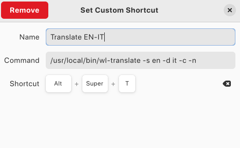

# wl-translate
A simple tool to translate text on the fly using Google Translate API.  
It can be used to quickly translate text using a fast combination of keyboard shortcuts: this improves productivity and translation speed without having to keep switching to Google Translate.

Following packages are needed:
- **xclip** (on X11) or **wl-clipboard** (on wayland)
- **curl**
- **python**
- **notify-send**

# How i use it?

I have two custom shortcuts on Gnome: one for _italian-english_ and one for _english-italian_ translation:




When i want to translate something i **select the text** and press in **rapid succession**:
- **CTRL+C** (copy text i want to translate to the clipboard)
- **Alt+Super+T** or **Super+T** (translate clipboard content)
- **CTRL+P** (paste translated text)

This is very usefull especially when i'm writing notes or document: if I can't translate a sentence on the fly, I write it in Italian (my native language), select it with the mouse then quickly press CTRL+C, Super+T, CTRL+P and replace the text with the translated one.

# Usage 
```
wl-translate

SYNOPSIS: 
	wl-translate [-s source] [-d destination] [-t text] [--notify] [--copy]

DESCRIPTION:
	Uses Google Translate API to translate desired text.
	If no text is given will automatically get it form clipboard.
	Dependencies:
		xclip (on X11) or wl-clipboard (on wayland)
		curl
		python
		notify-send

OPTIONS:
	-h --help
			Show the manual

	-s --source
			Language from which to translate the text.
			Default is "auto" (automatic recognition).

	-d --destination
			Language to translate the text into.
			Default is English

	-t --text
			Text to translate. 
			If not text is given get content from Clipboard.
			If this script is started via Pipe this parameter is ignored: text is read via stdin

	-n --notify
			Send translated text to system notification

	-c --copy
			Copy translated text to clipboard

NOTE:
	This tool is intended to work with Wayland (wl-clipboard package is needed)!

EXAMPLES:
	wl-translate -t "buongiorno" && wl-translate -t "buenos dias"
		good morning
		good morning

	wl-translate -s en -d ru -t "good morning"
		доброе утро

	echo "ciao come stai?" | wl-translate -d es
		¿Hola como estas?

	echo "ciao...
	ecome stai?" | wl-translate -d de

		Hi, wie geht es dir?
	cat fileToTranslate.txt | translate
```